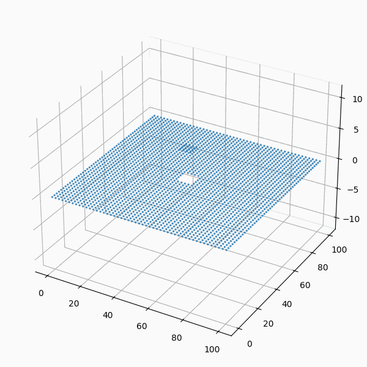

# FDM 2D Diffusion Solver


## Overviews

This code is a C language program that numerically solves partial differential equations (PDEs) in two dimensions using the finite difference method (FDM). It can be used to solve equations such as the wave equation and the diffusion equation, simulating how physical quantities like displacement or concentration evolve over time. The initial conditions typically include a localized disturbance or concentration in the center, and the simulation shows how this quantity propagates or diffuses through the domain. The resulting CSV files provide a time series of how the distribution changes, suitable for visualization and analysis.

## Usage

Run the following commands in each directory

```C
make
```

```C
./fem2d.exe
```

clean up command:
```C
make clean
```


### Diffusion Equations

This program (`./diffusion_equation/fe2d.c`) solves the following two-dimensional diffusion equation

$\frac{\partial u}{\partial t} = D \left( \frac{\partial^2 u}{\partial x^2} + \frac{\partial^2 u}{\partial y^2} \right)$

Where, $u(x, y, t)$: concentration at position $(x, y)$ at time $t$, $D$: diffusion coefficient.

### Program Description

- **Language**: C
- **Method used**: Finite Difference Method (FDM)
- **Boundary conditions**: _Dirichlet_ or _Neumann_ boundary conditions
- **Initial conditions**: Set a locally high concentration of material (value: 10.0) in the center of the region and simulate the diffusion around it.

## Show results

- _Dirichlet_ boundary conditions

  

- _Neumann_ boundary conditions

  

## Wave Equation

This program (`./wave_equation/fem2d.c`) solves the following two-dimensional wave equation:

$\frac{\partial^2 u}{\partial t^2} = c^2 \left( \frac{\partial^2 u}{\partial x^2} + \frac{\partial^2 u}{\partial y^2} \right)$

Where, $u(x, y, t)$: displacement at position $(x, y)$ at time $t$, $c$: wave propagation speed.

## Program Description

- **Language**: C
- **Method used**: Finite Difference Method (FDM)
- **Boundary conditions**: _Dirichlet_ or _Neumann_ boundary conditions .
- **Initial conditions**: A locally high displacement (value: 10.0) is set at the center of the region, and the wave propagation around it is simulated.

## Numerical Solution Overview

- The wave equation is solved by breaking it into two first-order differential equations.

  - **Velocity definition**: $v = \frac{\partial u}{\partial t}$
  - **Velocity update**: The velocity is updated using the Laplacian of the displacement.

      $v^{n+1}\_{i,j} = v^n\_{i,j} + \Delta t \cdot c^2 \left( \frac{u^n\_{i+1,j} - 2u^n\_{i,j} + u^n\_{i-1,j}}{\Delta x^2} + \frac{u^n\_{i,j+1} - 2u^n\_{i,j} + u^n\_{i,j-1}}{\Delta y^2} \right)$

  - **Displacement update**: The new displacement is then calculated using the updated velocity.

      $u^{n+1}\_{i,j} = u^n\_{i,j} + \Delta t \cdot v^{n+1}\_{i,j}$

## Show result


